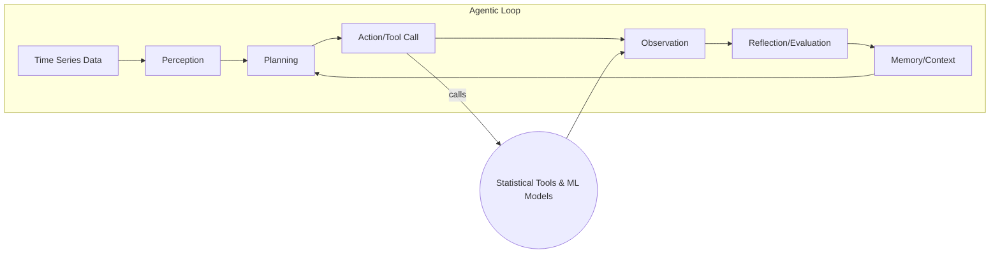
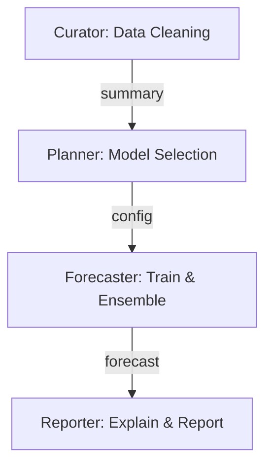
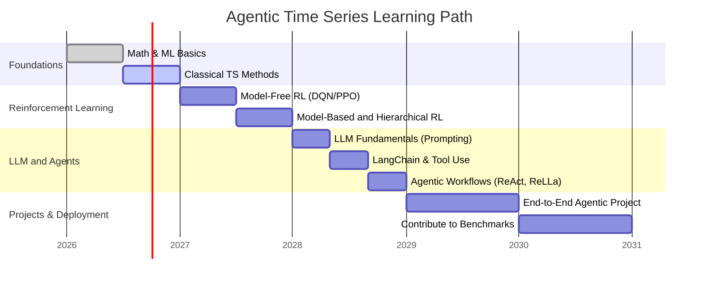

# Agentic Solutions for Time Series: Executive Summary  
Agentic time series (TS) systems treat forecasting, anomaly detection, and control as *interactive agentic processes* rather than one-shot predictions.  Recent work (e.g. *Beyond Model-Centric Prediction—Agentic Time Series Forecasting*) reframes TS forecasting as an agentic cycle of perception, planning, action, reflection, and memory.  In practice, this means using reinforcement-learning (RL) or planning agents that iteratively gather data, reason, adapt models or controls, and refine outputs.  A parallel trend is using large language model (LLM) agents (via frameworks like LangChain, Auto-GPT, ReAct, etc.) to orchestrate time-series analysis through tool use.  Multi-agent systems (e.g. cooperative “TSci” workflows) are also emerging, where specialized agents handle cleaning, model selection, forecasting, and reporting.  

This report surveys these agentic approaches.  We first define agentic TS concepts and categorize them (autonomous RL agents, planning/optimization agents, LLM agents, multi-agent systems, etc.). We then detail representative methods and architectures (RL, model-predictive control, hierarchical RL, imitation learning, POMDP-based planning, LLM-based agents with tool wrappers, transformer-based agents, etc.).  Concrete examples and tutorials – including code snippets and GitHub links – illustrate end-to-end workflows (e.g. using Stable Baselines3 for RL training, LangChain Pandas Agent for interactive forecasting, and multi-agent pipelines like TSci). We review popular frameworks and implementations (TensorFlow, PyTorch, JAX, RLlib, Stable Baselines3, OpenAI Gym/Procgen, LangChain, Auto-GPT, ReAct, etc.), and compare them in tables by capability and use-case.  Evaluation practices (benchmarks, metrics, datasets) are discussed, covering forecasting (M4/M5, *It’s TIME* benchmark, etc.), anomaly detection (Yahoo A1, NAB, SMD, etc.), and decision-making tasks.  Key metrics like RMSE/MAPE for forecasting and precision/recall/F1 for anomalies are reviewed.  We analyze pros/cons and limitations of each approach (data/computation demands, robustness and safety issues, domain assumptions).  Finally, we recommend starter projects and a learning timeline (with mermaid Gantt chart) to guide newcomers from fundamentals (ML/RL basics, classical TS) through advanced agentic TS techniques.  

## Definitions and Taxonomy of “Agentic” in Time Series  
**Agentic TS** systems go beyond static prediction: they *act* like autonomous agents that gather information, reason, make decisions, and learn over multiple turns.  In this context:  
- **RL Agents:** An agent (model or neural network) learns a policy to make sequential decisions from time-series inputs, optimizing a reward. This includes model-free (DQN, PPO, SAC, etc.) and model-based (world-models, planning/MPC) RL approaches. For example, reinforcement learning is used in supply chain forecasting: “companies like UPS and Amazon have developed RL algorithms to improve forecasting and strategy” under uncertainty.  
- **Planning/Model-based Agents:** These use explicit models of system dynamics (often via Model Predictive Control or other planning). At each step, they forecast future outcomes using a model and optimize the next action (common in control systems).  
- **Meta-learning Agents:** Agents that adapt quickly to new TS tasks by learning how to learn from few examples or from past tasks (e.g. gradient-based meta-RL on time series).  
- **LLM-Driven Agents:** Large language models (e.g. GPT-4, Gemini) act as reasoning cores, using natural language instructions, chain-of-thought, and tool-using frameworks (LangChain, ReAct, AutoGPT, etc.). These agents interpret TS data in context, call Python functions or statistical tools to preprocess/forecast, and iteratively refine answers (see *Project Scribe* or the TS-Agent framework).  
- **Multi-Agent Systems:** Multiple agents collaborate or compete, each handling subtasks or specializing (e.g. a “Curator” for data cleaning, a “Planner” for model selection, a “Forecaster” for training models, and a “Reporter” for output – as in the TSci system).  

Broadly, we can **taxonomy** agentic TS methods by their control flow and reasoning style.  One schema (EmergentMind.ai) distinguishes: **Direct** (one-shot LLM inference without feedback), **Linear Chain** (fixed multi-step script), and **Branch-Structured Agentic** (interactive loops, tool usage, memory).  Agentic loops allow feedback: the agent perceives data, plans, acts (e.g. calling a statistical tool), observes results, reflects (updates context), and repeats.  

Agents also differ by observability: **MDP vs POMDP** setups – often TS tasks are partially observed (latent states).  Some approaches explicitly formulate POMDPs for TS anomaly detection or control.  Others use hierarchical structures: e.g. hierarchical RL or multi-resolution forecasting (coarse agent defines goals, lower agent predicts fine-grained TS).  Finally, **imitation learning** can be used: learning forecasting strategies from expert demonstrations or static models.  

Mermaid diagrams below illustrate two architectures: a general agentic TS loop (with Perception→Planning→Action→Observation→Reflection cycles) and a multi-agent pipeline (e.g. TSci’s Curator/Planner/Forecaster/Reporter).  





## Representative Approaches and Algorithms  

- **Reinforcement Learning (RL):** RL agents learn to make sequential TS predictions or control decisions. Standard model-free methods (e.g. DQN, DDPG, PPO) have been adapted to forecasting tasks (e.g. treating prediction as an action, reward as accuracy). Model-based RL (learning an environment model) connects to control approaches like Model-Predictive Control (MPC). In MPC, at each time step the agent uses a learned or known model of the system to simulate future trajectories and pick optimal controls (common in control engineering). Hierarchical RL decomposes tasks (e.g. high-level agent sets goals, low-level agent forecasts or controls at finer granularity).  

- **Model-Predictive Control (MPC):** A planning-based method where a model predicts future TS values under candidate actions; an optimizer chooses the best action sequence under constraints. MPC is widely used in process control (chemicals, energy) and can incorporate learned TS predictors. It can be viewed as an “agent” solving a dynamic optimization at each step.

- **Imitation Learning:** Here an agent learns TS forecasting or control by imitating expert trajectories (e.g. using behavioral cloning on historical actions or decisions). For example, an RL agent could be pretrained to mimic a baseline forecaster, then refined.  

- **POMDP and Filtering Approaches:** When the TS has hidden states, agents may be formulated in a POMDP framework, using belief or filtering to update hidden state estimates (e.g. using particle filters or Bayesian filters) before decision-making.

- **LLM-based Agents with Tool Use:** Recent work embeds LLMs (LLM4TS) as reasoning engines that call external tools. For instance, **TS-Agent** uses a ReAct loop: the LLM reasons about TS data, issues calls to statistical tooling (Python code or libraries) to compute sums, trends, etc., observes results, and refines queries. Tools may include ARIMA/SARIMA modeling, decomposition, or anomaly algorithms. These agents often maintain a log of reasoning (chain-of-thought) and can engage in multi-turn Q&A with domain experts. The **LangChain Pandas Agent** is a notable example: it exposes Pandas operations to an LLM, enabling natural-language-driven data cleaning, visualization, and forecasting.  
    *Figure: Key capabilities of a LangChain Pandas Agent for time-series data (e.g. cleaning, indexing, resampling, visualization, and ARIMA/SARIMA-based forecasting).*  

- **Multi-Agent Systems:** Some frameworks use *multiple cooperating agents*. For example, the TSci system uses four LLM-agents: a *Curator* (cleans data, extracts structure), a *Planner* (selects and tunes models), a *Forecaster* (trains/ensembles models), and a *Reporter* (generates final reports). In general, agents may share information via a “master” controller or a blackboard. Multi-agent RL can also apply, where agents learn specialized policies for sub-tasks.  

- **Transformers with Agentic Wrappers:** Advanced TS models (Temporal Fusion Transformers, N-BEATS, etc.) may be embedded in an agentic loop. For instance, a transformer could provide initial forecasts, while an agentic wrapper evaluates errors, requests recalibration, or calls other models. Some works “bootstrap” TS transformers via LLM feedback or human-in-the-loop (e.g. using GPT-4 to critique model predictions).

- **Meta-Learning Agents:** These learn to adapt TS models quickly across tasks. For example, a meta-RL agent might learn an initialization that generalizes across many TS datasets, fine-tuning online as data arrives.

- **Imitation / Active Learning:** Some anomaly-detection agents (e.g. RLAD) use active learning: the agent asks for labels on uncertain points, and learns a detection policy. LLMs can guide reward shaping: one recent work uses an LSTM-based RL agent for anomalies, with an LLM giving semantic rewards and a VAE supplying unsupervised signals.

The table below compares broad classes of approaches:

| Approach        | Example Methods/Models         | Typical Use-Cases          | Strengths                                             | Weaknesses                                        |
|-----------------|-------------------------------|----------------------------|-------------------------------------------------------|---------------------------------------------------|
| **RL Agents**   | DQN, PPO, SAC, Model-based RL | Forecasting as decision, control tasks (inventory, trading) | Learns via interaction; handles nonstationarity; optimizes long-run reward | Needs many data/simulations; sensitive tuning; design of reward can be hard |
| **Planning/MPC** | MPC, POMDP solvers, A*       | Control under constraints  | Principled optimization; can enforce constraints     | Requires good model; computationally intensive; limited to known structure |
| **LLM Agents**  | LangChain (Pandas Agent), Auto-GPT, ReAct, TS-Agent | End-to-end analysis, forecasting with prompts/questions | Flexible natural language interface; leverages external knowledge; integrates diverse tools | Hallucinations; opaque decision logic; heavy computation; requires careful prompting |
| **Multi-Agent** | TSci pipeline, ensemble agents | Complex workflows (data cleaning, forecasting, reporting) | Specialization of roles; richer reasoning; robustness through ensembles | System complexity; coordination overhead; harder to train/manage |
| **Meta-learning** | MAML, ProtoNets, Meta-RL     | Rapid adaptation to new TS tasks | Few-shot learning; transfer across series | Still data-intensive; challenging design |
| **Imitation/Active** | Imitation learning, RLAD etc. | Anomaly detection, policy cloning | Leverages expert knowledge; can bootstrap RL | Requires labeled trajectories; possible covariate shift |

## Example Workflows and Tutorials  

To ground these concepts, here are concrete examples and resources:

- **Reinforcement Learning for TS Forecasting:** One can define a Gym-like environment for a forecasting task and apply standard RL libraries. For example, using Stable-Baselines3 (PyTorch) one could train a PPO agent to predict stock prices or control inventory. The SB3 example below shows the classic CartPole use; a similar pattern applies if you create a custom `TimeSeriesEnv` (implementing `gym.Env`):  

  ```python
  import gym
  from stable_baselines3 import PPO
  env = gym.make("CartPole-v1")
  model = PPO("MlpPolicy", env, verbose=1)
  model.learn(total_timesteps=10000)
  ```  

  *Listing: Training a PPO agent (from Stable-Baselines3) in a Gym environment.* This can be adapted by registering a TS forecasting environment (e.g. predicting next value), and using the agent’s actions as model predictions or control signals.  

- **LangChain Pandas Agent (Forecasting by Tool Use):**  The [LangChain Pandas Agent](https://langchain.com/) provides a hands-on tutorial for TS analysis. It can answer natural-language questions about a dataset and call Pandas functions internally. For example, after loading a CSV of Tesla stock prices, the agent can compute statistics, visualize data, detect anomalies, and even fit an ARIMA model by prompting with plain English. This approach uses ReAct style loops with a toolbox of Python functions (e.g. for ARIMA forecasting). Tutorials (e.g. Data Science Dojo’s blog) include code snippets and walked-through examples. In the [Project Scribe GitHub repo] (Figure below), a LangChain agent autonomously explores unknown TS datasets, asks the user for guidance on forecasting horizons, runs SARIMA model search, and generates reports.  

- **Multi-Agent TSci Example:** The *TSci* system (Dataism Lab) illustrates a four-agent pipeline for time series science. A blog post (Medium) describes how each agent operates: the *Curator* cleans data, the *Planner* picks models, the *Forecaster* ensembles predictions, and the *Reporter* compiles a final report. The article includes images of the pipeline and code snippets for deploying such agents. Although not fully open-source, it serves as inspiration and outlines a rigorous evaluation (TSci outperforms baseline LLM-only systems by ~38% error reduction).  

- **Example Repos and Notebooks:**  
  - *Project Scribe* (GitHub) – an open-source LangChain agent that conducts end-to-end TS forecasting analysis, including prompt templates and SARIMA search tools.  
  - *Agentic Time Series Analysis and Reporting* (GitHub) – shows how to structure a conversational agent for TS data (code above).  
  - *Stable Baselines3 Examples* – the SB3 documentation provides Colab notebooks and examples (see [Stable-Baselines3 GitHub] for PPO training sample).  
  - *OpenAI Gym* – for RL, one can use Gym environments; though no standard TS env exists, custom Gym envs (e.g. OpenAI’s trading envs) are often available as starting points.  

- **Tutorial Snippets:** When writing agent code, one often combines loops and tool calls. For example, a LangChain-like loop in pseudocode:
  ```python
  while not done:
      thought = LLM.plan(context)
      if thought.includes("CALL_TOOL"):
          tool_result = run_tool(thought)
          context.append(tool_result)
      else:
          action = LLM.generate_action(context)
          observation = environment.step(action)
          context.append(observation)
  ```
  This ReAct pattern (LLM ↔ tools ↔ environment) is common in agentic TS pipelines.  

These examples show how agents integrate TS analysis with reasoning, rather than replacing it with a single model. They often rely on coding frameworks (see next section) and interactive computation.  

## Frameworks and Implementations  

**Machine Learning Backends:** Most approaches use standard DL frameworks. *PyTorch* and *TensorFlow/Keras* dominate for implementing neural agents, TS models, and LLM adapters. *JAX* has also emerged (e.g. Stable-Baselines-X, Flax, Haiku) for high-performance or research code.  

**Reinforcement Learning:**  
- *Stable-Baselines3 (SB3)* (PyTorch): easy-to-use library with algorithms like PPO, DQN, SAC. Good for prototyping RL on TS control tasks.  
- *Ray RLlib* (Python): Scalable RL framework from Ray. Supports distributed training and many algorithms. Useful when training on large TS corpora or multiple simulations.  
- *Gym / Gymnasium / Procgen*: Standard RL environment API. No built-in TS forecasting env, but many custom envs exist (trading, inventory, etc.). *Procgen* provides procedurally generated games for testing RL robustness (not TS-specific).  
- *PettingZoo*: RL for multi-agent (useful for TS tasks with interacting agents).  

**Deep Learning / Time Series:**  
- *Hugging Face Transformers:* For LLMs and TS-specific models (e.g. Time Series Forecasting Transformers, or adapters of GPT to time data).  
- *TorchTS, Darts, Nixtla (TimeGPT):* Libraries for time-series modeling (including neural forecasting, evaluation metrics) that can be integrated into agents.  
- *Flux.jl* (Julia) or others: some research uses Julia for TS models, though Python dominates.  

**LLM Agent Frameworks:**  
- *LangChain:* (Python) Framework for building LLM agents with chains-of-thought and tools. Supports Pandas, SQL, Python REPL tools, and custom tools. Often used for TS agentic workflows.  
- *AutoGPT / BabyAGI:* Autonomous LLM agents (mostly experimented for general tasks). Could be adapted for TS tasks by giving them memory and goal modules.  
- *LLMToolKit / ReAct protocols:* Not formal frameworks, but patterns (like ReAct or Toolformer) guide architecture of LLM agents.  

**Multi-Agent and Orchestration:**  
- *RLlib* also supports multi-agent settings.  
- *Workflow tools:* Airflow/Kubeflow might orchestrate multi-step agent pipelines (e.g. run a cleaning agent, then forecasting agent, etc.).  
- *Langflow:* A visual interface for LangChain-like flows (mention in future work of Project Scribe).  
- *SageMaker RL, GA tools:* For large-scale experiments.  

**Datasets and Benchmarks:**  
Time-series tasks rely on many public datasets (see next section), but frameworks themselves are generally domain-agnostic.  Many implementations come as Jupyter notebooks or example repos (e.g. the SB3 GitHub provides Colab notebooks). The **TROUBADOUR000/Awesome-Agentic-Time-Series** repo collects many papers and links (incl. GitHub links) for new agentic TS systems, which is a useful pointer to example code.

## Evaluation, Benchmarks, and Metrics  

Agentic TS systems should be evaluated both on predictive performance and on decision/outcome quality. Key aspects:

- **Forecasting Benchmarks:**  Traditional TS forecasting benchmarks (M4, M5, Kaggle competitions) focus on point accuracy. Newer benchmarks include *It’s TIME* (2026) and *fev-bench* (2025), aiming to stress realism.  Metrics: RMSE, MAE, MAPE, sMAPE are common. For probabilistic forecasts, CRPS or quantile losses are used. We cite Nixtla’s guidance for details (RMSE penalizes large errors, MAPE is scale-independent, CRPS for full distribution).  

- **Anomaly Detection Datasets:**  Widely used benchmarks include the Yahoo A1 dataset, Numenta Anomaly Benchmark (NAB), SWaT (water treatment), SWaT, SMD (server machine data), etc.  Evaluation metrics reflect imbalance: precision, recall, and F1-score are favored. In practice, one often selects the most relevant metric: e.g. prioritize *recall* if missing anomalies is dangerous, or *precision* if false alarms are costly. Area under ROC/PR curves can also be reported.  

- **Reinforcement Learning Performance:**  For control/decision tasks, **episodic return** (cumulative reward) is the standard metric. In forecasting-as-RL, one might define reward = negative forecast error and report average return. Robustness and sample efficiency (learning speed) are also key.  

- **Time Series Reasoning QA:**  A flurry of new benchmarks assess LLM/agent *reasoning* on TS: e.g. TimeSeriesExam, TSAQA, CaTS-Bench, etc.. These test whether an agent can answer structured TS questions or explain patterns. Metrics here include question-answer accuracy or human-judged plausibility.

- **Agentic System Evaluation:**  Ultimately, agentic systems are judged by *task performance* plus *costs/efficiency*. For forecasting, one may evaluate improvement over static models. For end-to-end pipelines, metrics include time-to-insight, robustness to noise, and adaptability to nonstationarity. Some works propose novelty metrics (e.g. Foresight Arena for forecasting agents).

- **Datasets:**  Many datasets are available:
  - *Forecasting:* M4 (100k series), electricity, traffic, weather, financial (exchange rates), etc. Specialized datasets: *Fidelity-TS* (multimodal, 2025), *FinTexTS* (text+finance).  
  - *Anomaly:* NAB (real web traffic), Yahoo A1-A4, ECG datasets, IoT sensor logs, synthetic benchmarks.  
  - *Multimodal:* With text or images (stock data + news), see *FinMultiTime*, *Time-IMM*, *TimeMMD*.  
  - *Reasoning QA:* ODTQA-FoRe, TimeSage-MT, TemporalBench, etc..  
  - *RL/Control:* OpenAI Gym classics (CartPole, Pendulum), plus domain sims (inventory management, process control). Supply-chain environments exist (see [33]) but often custom.  

A summary table:

| Task         | Example Benchmarks/Datasets             | Common Metrics                          |
|--------------|-----------------------------------------|-----------------------------------------|
| Forecasting  | M4, M5, It’s TIME, fev-bench, Weather, Energy | RMSE, MAE, MAPE, CRPS (for probabilistic) |
| Anomaly      | Yahoo A1/NAB, SMD, SWaT, Numenta, ECG   | Precision, Recall, F1, ROC-AUC or PR-AUC |
| Control/RL   | OpenAI Gym tasks, Supply-chain sims  | Average Reward (Return), Stability |
| Multi-Agent  | (e.g. Google Research Multi-TS set)     | Same as above + communication overhead |
| QA/Reasoning | TimeSeriesExam, CaTS-Bench, TSAQA | Accuracy of answers, human eval |

## Pros, Cons, and Limitations  

**Pros:** Agentic systems can *adapt* and utilize rich context. RL agents can discover strategies over time and handle non-stationary processes. LLM agents can incorporate human language reasoning and external knowledge, making TS workflows more flexible (e.g. asking “show me seasonality”). Multi-agent workflows (like TSci) modularize expertise and produce audit trails. These systems can automate tedious TS analysis steps and potentially improve robustness and interpretability by integrating reasoning layers.  

**Cons:** They are complex. RL requires vast data or simulations and can be unstable. Specifying rewards for forecasting is non-trivial. LLM agents may hallucinate or produce inconsistent advice if not grounded; Project Scribe avoids “hallucinations” by forcing all computations through real tools. LLMs also struggle with precise numerical forecasting – as noted, even advanced LMs “cannot reliably forecast stock prices” alone. Agentic loops add engineering overhead (logging memory, designing tool APIs). Multi-agent systems amplify this: agents must coordinate and may incur latency or errors in communication.  

**Safety and Robustness:** In critical domains (finance, healthcare), erroneous forecasts or anomaly misses can be costly. Agents must be tested for reliability; fallbacks or human oversight are advised. LLMs bring biases from training data – their suggestions (e.g. "reasons" for a trend) need verification. RL agents can sometimes exploit loopholes (e.g. gaming their reward). All systems require robust monitoring (e.g. out-of-distribution checks).  

**Compute and Data Needs:** RL training can be compute-intensive (many episodes) unless simulations are fast. LLM agents require either API access (with latency/cost) or local large models (expensive GPUs, memory). Libraries like Ray (for distributed RL) or LoRA/8-bit quantization (for LLMs) can mitigate costs. Time-series models themselves often need lots of history; however, agentic approaches can sometimes generalize by reasoning or memory rather than brute data.  

**Deployment:** RL and traditional TS models can be exported (ONNX/TorchScript) and run on edge or server. LLM agents often run via API calls (e.g. OpenAI, Google), so deployment involves cloud integration. Frameworks like LangChain provide Docker deployments. Agents producing explainable reports (like TSci’s *Reporter*) ease integration into business pipelines. Nevertheless, agentic systems may have higher inference latency due to multi-step reasoning.

## Recommended Starter Projects and Learning Path  

**Beginners:** Start with fundamentals: implement basic TS models (ARIMA, Prophet, LSTM) on public data. Build a simple RL agent on a Gym env (e.g. OpenAI CartPole or a stock-prediction env) to learn policy learning. Explore LangChain’s Pandas Agent on a toy dataset (there are tutorials available).  

**Intermediate:** Try building a custom Gym environment for a TS forecasting problem (e.g. given past 10 values, predict next; reward = negative error). Use Stable-Baselines3 to train DQN or PPO. Experiment with Ray RLlib for distributed training on multiple TS series. Next, implement an LLM agent for analysis: e.g. use LangChain to create a Python tool that computes ARIMA forecasts, and let the LLM call it in a loop. Look at the *Agentic Time-Series Analysis & Forecasting* repos for guidance.  

**Advanced:** Contribute to open-source: implement an agentic pipeline (data cleaning, forecasting, report) on GitHub. Reproduce results from a paper (e.g. TS-Agent or TSci). Evaluate on standard benchmarks (*It’s TIME*, NAB, etc.). Study hierarchical or meta-RL methods for TS (papers in the *Awesome* list). Learn to use advanced LLM frameworks (LangChain, AutoGPT) for creating an autonomous data scientist agent.  

**Learning Timeline (Gantt):** Below is a suggested multi-year roadmap.  It assumes a self-learner in 2026 onward:



**Key Resources:**  
- *Textbooks/Courses:*  “Reinforcement Learning: An Introduction” (Sutton & Barto), online RL courses (Spinning Up by OpenAI). TS courses from Coursera/Udemy on forecasting.  
- *Tutorials:* SB3 documentation, Gym tutorials, LangChain docs and examples.  
- *Community:* Agentic AI workshops, GitHub repos (e.g. *Awesome Agentic TS* list), Kaggle forums.  

Overall, a solid grounding in ML/RL and time-series fundamentals, followed by hands-on experimentation with RLlib/SB3 and LangChain, will pave the way to mastering agentic TS systems.

